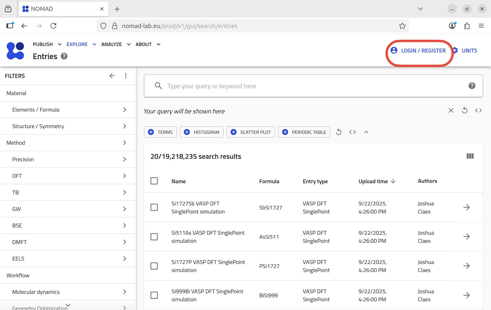
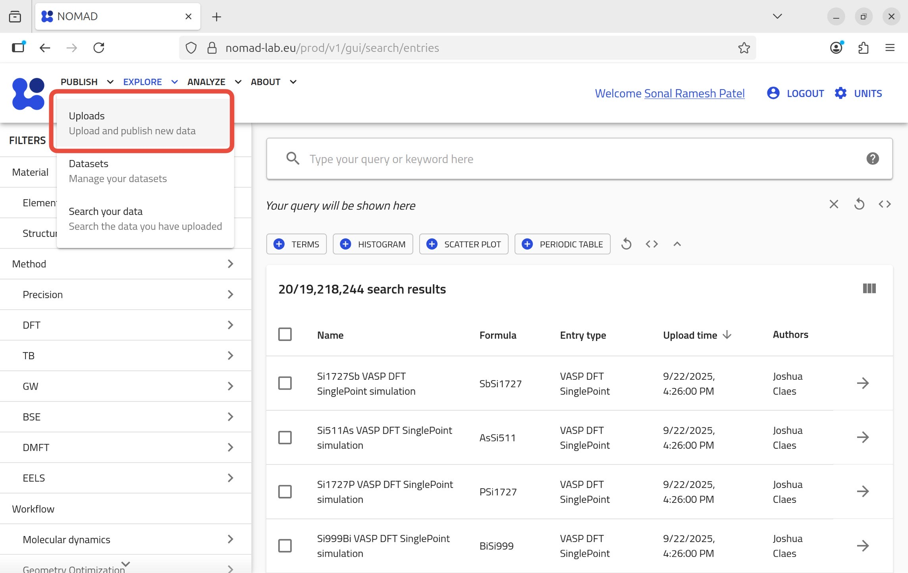
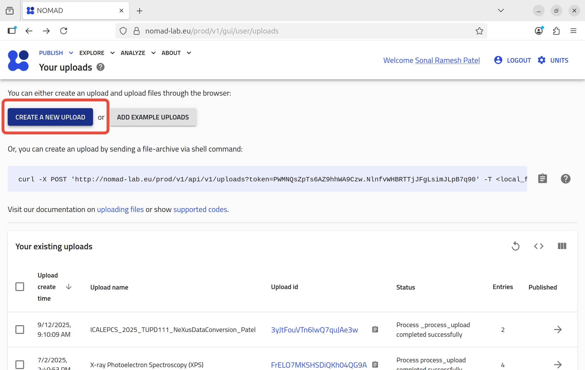
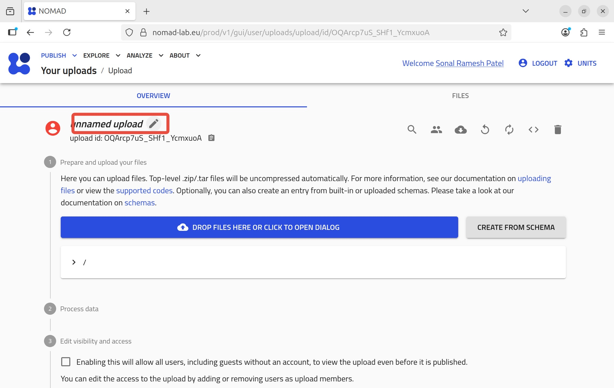
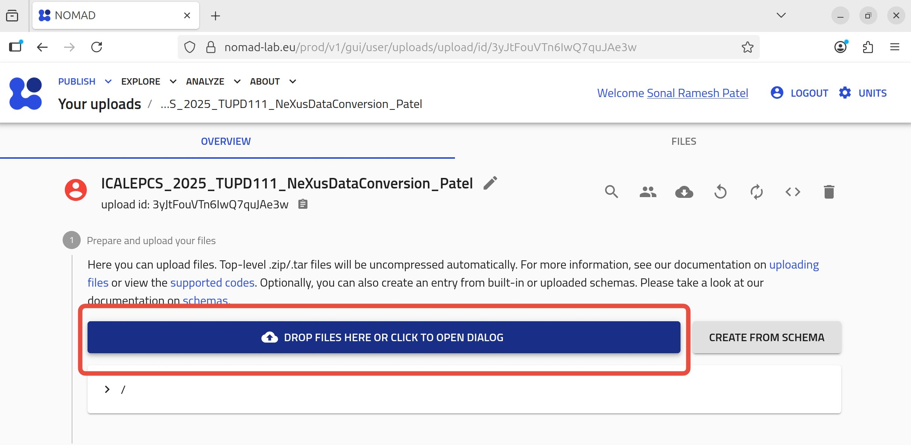
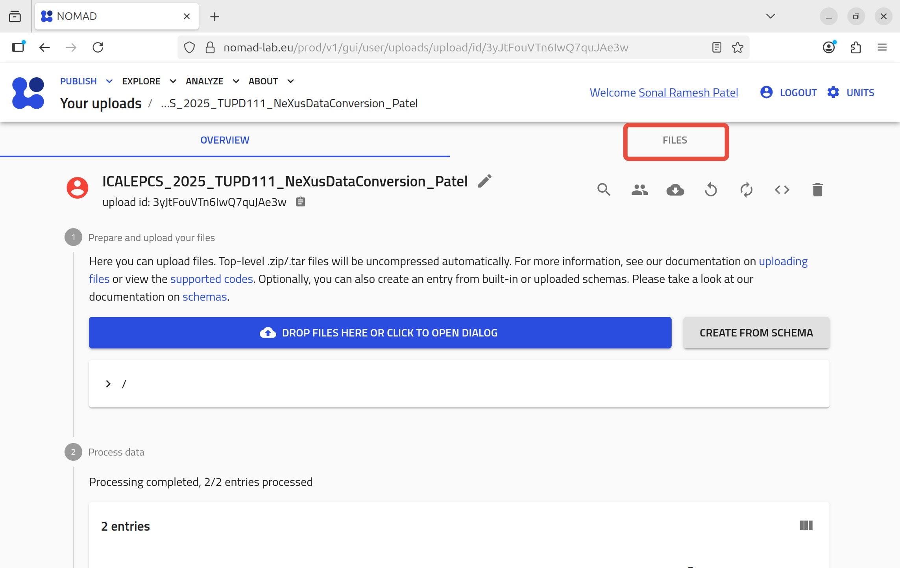
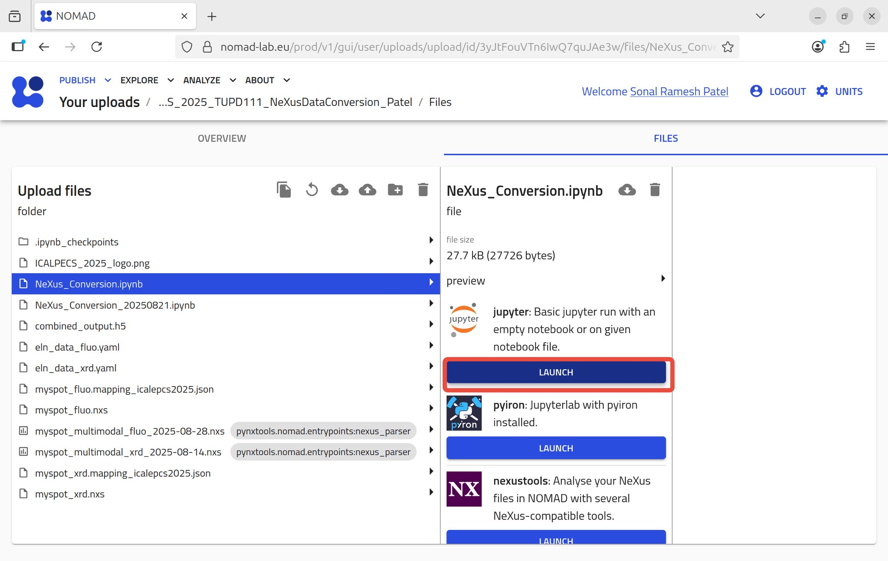
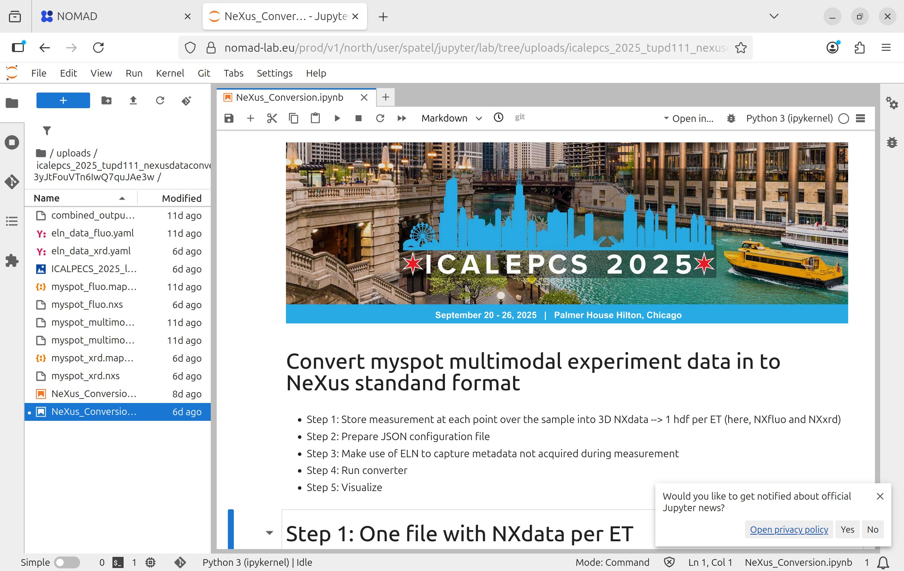

#### The NeXus data conversion workflow explain in the paper can be run with the notebook `NeXus_Conversion.ipynb` on NOMAD data management platform. 

Please follow the steps below to run this notebook on NOMAD.

1. Goto https://nomad-lab.eu/nomad-lab/ and `Open NOMAD`

2. Login / Register from `LOGIN/REGISTER`

3. Go to Uploads section under `PUBLISH`

4. `CREATE A NEW UPLOAD`

5. Give meaning full name to your upload

I have used name *ICALEPCS_2025_TUPD111_NeXusDataConversion_Patel* in this example.

6. Clone this repository and drop the folder *2025_ICALEPCS* 

7. Go to `FILES` to access the files of the *2025_ICALEPCS* folder

8. Launch the NOMAD Remote Tools Hub (NORTH) to run Jupyter notebook

9. The notebook *NeXus_Conversion.ipynb* is ready to play. Enjoy the beauty of the NeXus data.

